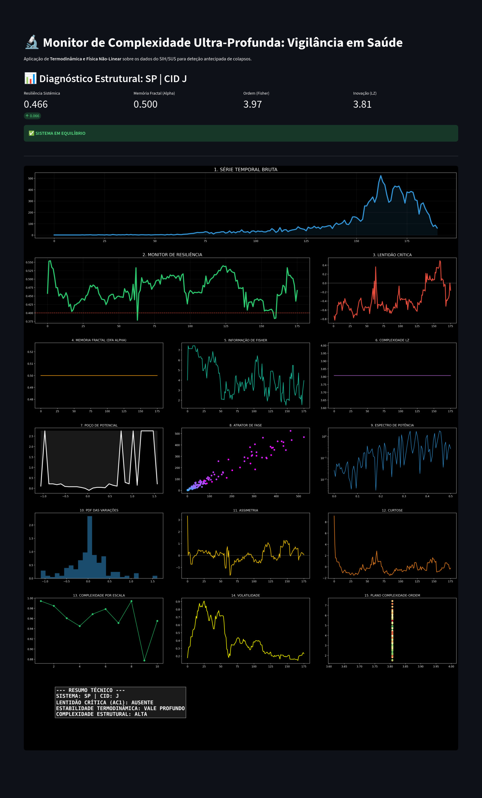

# QWAN — Quantum Wholeness Applied to Nonlinear Health Systems

> Early Warning Signals of Systemic Instability in Hospitalization Dynamics  
> A Non-Equilibrium Statistical Physics Framework Applied to SIH/SUS

---

## Overview

QWAN is a theoretical and computational framework for detecting **critical transitions in health systems** using tools from:

- Nonlinear dynamical systems
- Stochastic differential equations
- Statistical physics
- Information theory
- Algorithmic complexity

The framework models hospitalization time series as **metastable stochastic systems** approaching bifurcation points, enabling early detection of systemic instability.

The dashboard is merely a visualization layer.  
The core contribution is the **mathematical and theoretical structure** described below.

---

# 1. System Ontology

We model territorial hospitalization counts as a stochastic nonlinear process.

### Discrete formulation

\[
X_{t+1} = f(X_t) + \epsilon_t
\]

### Continuous-time formulation (Langevin dynamics)

\[
dX = F(X,\theta)dt + \sigma dW_t
\]

Where:

- \( X_t \) = hospitalization intensity
- \( F(X,\theta) \) = structural system dynamics
- \( \sigma dW_t \) = stochastic epidemiological noise
- \( \theta \) = control parameters (seasonality, epidemics, infrastructure load)

This places QWAN within:

- Nonlinear dynamical systems theory
- Stochastic processes
- Metastable regime analysis

---

# 2. Critical Transition Theory

As the system approaches a bifurcation (e.g., fold bifurcation):

\[
\frac{dF}{dX} \to 0
\]

The dominant eigenvalue of the Jacobian approaches zero:

\[
\lambda_{max} \to 0^{-}
\]

Observable consequences:

| Indicator | Behavior Near Critical Point |
|-----------|------------------------------|
| Autocorrelation (lag-1) | ↑ |
| Variance | ↑ |
| Recovery rate | ↓ |
| Resilience | ↓ |

This phenomenon is known as **Critical Slowing Down (CSD)**.

---

# 3. Effective Potential Reconstruction

Assuming the Fokker–Planck equation governs the probability density evolution:

\[
\frac{\partial P}{\partial t}
=
-\frac{\partial}{\partial x}(F(x)P)
+
\frac{\sigma^2}{2}
\frac{\partial^2 P}{\partial x^2}
\]

At stationary equilibrium:

\[
P(x) \propto e^{-2U(x)/\sigma^2}
\]

Thus, the effective potential can be reconstructed as:

\[
U(x) = -\frac{\sigma^2}{2} \log P(x)
\]

Interpretation:

- Deep single well → stable regime
- Shallow well → low resilience
- Double well → multistability
- Flattening landscape → approaching transition

This is a direct application of **non-equilibrium statistical physics** to epidemiological dynamics.

---

# 4. Structural Complexity Metrics

QWAN integrates multiple structural measures.

---

## 4.1 Detrended Fluctuation Analysis (DFA)

Measures long-range temporal correlations.

- α = 0.5 → white noise
- α > 0.5 → persistent dynamics
- α < 0.5 → antipersistent

Relation to power spectrum:

\[
S(f) \sim f^{-\beta}
\quad \text{where} \quad
\beta = 2\alpha - 1
\]

---

## 4.2 Lempel–Ziv Complexity

Approximates algorithmic complexity:

\[
C_{LZ} \sim \frac{c(n)\log n}{n}
\]

Detects structural novelty and emergent patterns.

---

## 4.3 Fisher Information

\[
I = \int \frac{(\partial_x p)^2}{p} dx
\]

High Fisher → ordered system  
Low Fisher → structural degradation  

Fisher Information often decreases near regime shifts.

---

## 4.4 Multiscale Entropy

Captures structural complexity across temporal scales:

\[
MSE(s) = H(\text{coarse-grained signal at scale } s)
\]

Loss of multiscale entropy coherence may signal systemic degradation.

---

# 5. Resilience Definition

We define instantaneous systemic resilience as:

\[
\mathcal{R}_t =
1 -
\left(
w_1 AC1_t +
w_2 \alpha_t +
w_3 \tilde{\sigma}_t
\right)
\]

Where:

- \( AC1_t \) = lag-1 autocorrelation
- \( \alpha_t \) = DFA exponent
- \( \tilde{\sigma}_t \) = normalized volatility
- \( w_i \) = weighting coefficients

Resilience declines as the system approaches a critical threshold.

---

# 6. QWAN Structural Instability Index

We define a composite instability index:

\[
\mathcal{QWAN}_t =
z(AC1_t)
+
z(\alpha_t)
+
z(LZ_t)
-
z(Fisher_t)
\]

Where:

- \( z(\cdot) \) denotes standardized values.

Interpretation:

- High QWAN → structural instability
- Moderate QWAN → metastable regime
- Low QWAN → stable configuration

---

# 7. Regime Interpretation

QWAN operates under a metastable systems perspective:

| Regime | Characteristics |
|--------|-----------------|
| Stable | Deep potential well, low AC1 |
| Metastable | Flattening potential, increasing memory |
| Critical | High AC1, rising variance |
| Post-transition | New attractor state |

This connects directly to:

- Fold bifurcations
- Saddle-node transitions
- Non-equilibrium phase transitions

---

# 8. Application to SIH/SUS

Hospitalizations are treated as:

\[
X(t) = \text{territorial hospitalization flux}
\]

Possible applications:

- Early detection of hospital overload
- Monitoring respiratory outbreaks (CID J)
- Detecting systemic stress before peak incidence
- Identifying territorial fragility

---

# 9. Validation Roadmap

To elevate QWAN to publication-level rigor:

1. Historical backtesting (e.g., COVID waves)
2. ROC analysis (predictive performance)
3. Sensitivity/specificity evaluation
4. Comparison with:
   - Moving averages
   - ARIMA
   - Prophet
5. Regime detection via HMM

---

# 10. Theoretical Positioning

QWAN integrates:

- Critical Transition Theory (Scheffer, Dakos)
- Langevin & Fokker–Planck formalism
- Information theory in dynamical systems
- Algorithmic complexity theory
- Non-equilibrium thermodynamics

It proposes a unified lens for **systemic health stability analysis**.

---

# 11. Conceptual Contribution

QWAN reframes hospital systems as:

> Nonlinear stochastic dynamical systems exhibiting metastability and regime shifts.

Rather than reactive epidemiological monitoring, it enables:

- Structural diagnostics
- Early instability detection
- Dynamical resilience quantification

---

# 12. Future Directions

- Bayesian regime filtering
- Hidden Markov regime classification
- Reinforcement learning for adaptive intervention modeling
- Spatial QWAN mapping
- Multi-variable coupling (admissions, ICU occupancy, mortality)

---

# Citation (Draft)

If using this framework, cite as:

Dourado, L. (2026).  
**QWAN: A Non-Equilibrium Statistical Physics Framework for Early Warning Detection in Health Systems.**

---

# License

MIT

---

> QWAN treats health systems not as static datasets, but as living dynamical structures evolving under stochastic forces.
